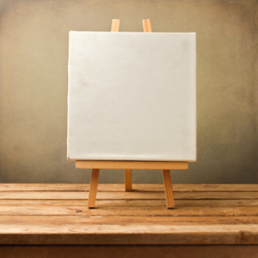
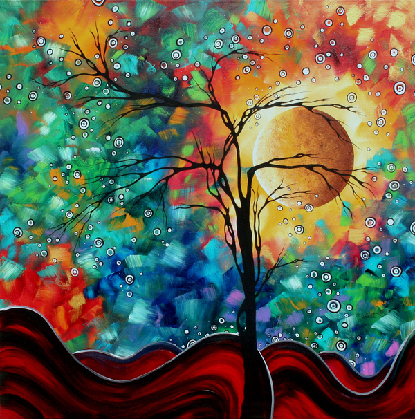

# Imagining the Painting
Common problems all artists run into is imagining their painting on a canvas. Starting from the beginning is the hardest part, and often requires a lot of imaginitivity. If all artists had no references and direction, then the canvas may be blank for hours! However, thanks to the design patterns of reusing different shapes, color combinations, etc, it allows them to paint their ideal painting to go from something like this:  to this! : 

Likewise, software engineers often struggle with designing their websites or apps from scratch. The ideal UI or system architecture can feel just as intimidating as a blank canvas. It should be beautiful, functional, and intricate. This way, all software engineers can achieve their ideal UI and backend functionality for any website, app, etc. that they see fit in the easiest way possible. However, much like painting, these "blueprints" will never make your whole creation for you. These design patterns just tell you the necessary components for a good website.

# The Flow of the Brush and Water
Every painter relies on a brush—just one, used carefully to apply every stroke. In software, this is like the Singleton pattern, where a central component—like app-wide state in React—needs to exist only once to coordinate everything from theme to authentication. 
Furthermore, good artists always keep a glass of water next to them to rinse off the brush and prepare for a new color to be added to the canvas. My brush in this instance would be the notification system in my code that will react to changes in the user data and apply them. 

# Shading
But what is a good painting without the shading on it as well? Otherwise, it would just be a plain jane canvas with contrasting colors that do not blend at all. The shaders in this case would be the API's that always give a response to match the modern interface of the deployed website. This ensures that my website is smoothly presenting all the user data that I need it to according to the design pattern!

# My Painting so Far
In my Manoa Compass project, I used the Next.js framework and React library to give myself a sturdy canvas to build on—just like an artist might start with pre-stretched linen or a sketched outline. My brush—the essential tool for crafting the painting—is the authentication system. It ensures every front-end stroke connects seamlessly with the backend, where all the user data is stored. This brush only exists once and applies consistent strokes across the canvas—just like the Singleton design pattern, which manages centralized app state or authentication.

Then come the APIs—my palette of colors and textures. They dynamically fetch and push user data to and from the database, making sure what the user sees on their profile page reflects the current state of their data. To keep this presentation clean and usable, I also implemented a kind of translator—similar to the Adapter pattern—that makes the backend data fit the shape expected by my UI components.

# Final Touches
Ensuring the completion of the masterpiece requires both creativity and structure. With well-used design patterns—like shading, balance, and brush technique—my website, like my painting, transforms into a well-crafted whole. Design patterns don’t do the painting for you, but they help you get from chaos to clarity, from blank canvas to finished work.
