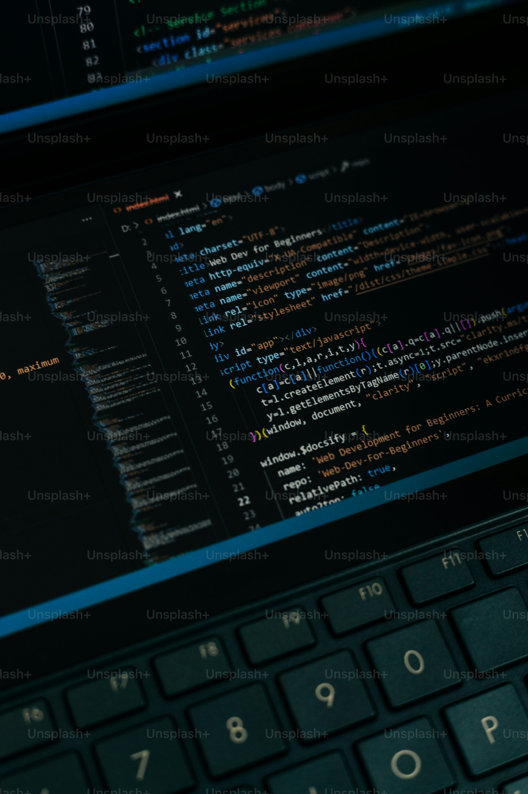

Design Patterns, User Interface Frameworks

# Introduction
The world of Software Engineering is a very vast, fulfilling one. Whether it comes to back-end development or front-end development, both sides have their own knick knacks to benefit the developer and make their code/website clean, organized, and efficient. In <i>ICS 314</i> so far, I have found two areas of Software Engineering that contributed greatly to my education and project management for my final, <strong><i>Manoa Compass</i></strong>. These would be <strong>Design Patterns</strong> and <strong>Agile Project Management Style</strong>.

# Design Patterns Pave the Way to Organized Code
Simply put, these patterns utilize existing framework foundations such as having a database with <i>Prisma</i>, <i>React</i> style coding, <i>API routes</i> for pages that get user input, <i>Nextjs</i> website templates, and more! Personally, I have used all of these mentioned tools to aid in completeing my final project since they all saved me a lot of time and steered me away from writing bad code. For example, my team started the website using the Nextjs framework to give us an easy base to edit over and make our idea come true. This is an example of a front-end design pattern that can easily cut time and make the front-end development easier for developers that are just starting a website project. Furthermore, we also made API route files for almost all of our pages to ensure that we were always reflecting the current state of the user's data. Design Patterns always give you ways to write cleaner, more maintainable code that can be reused on your other projects. Beyond web-applications, I can see myself using Design Patterns in the games I develop, specifically ones that require state and component behaviors with in-game AI and object behavior. After all, there is no point in making a new solution to something that has a credible one already!

# Agile Project Management Style Speeds up Projects Efficiently
This style is the bread and butter of a Software Engineering team. Agile Project Management Style is a flexible, rapid paced development style that incorporates continuous collaboration, responses to user feedback, and deliveries. Hence the name <strong>Agile</strong>, this typically takes place over 3-4 weeks in order to finish a project as quickly, but efficiently as possible. In my case, my team used the Issue Driven Project Management Style in the final project because it allowed us to know what changes each individual member is trying to push to our github repository. Furthermore, it made our development process more structured and organized in accordance with the due date of the project. Without the use of this style, we could have procrastinated too hard on some areas of our project and caused unnecessary conflicts in our code that could have cost us our grade. In the real-world, I feel that this style of project management is used almost everywhere. Not just in the Computer Science field, but also in the <i>Business</i> and <i>Healthcare</i> fields. Each field has a team of people working to either run campaigns and deliver product to promote the business or to develop new patient programs and conclude research projects, respectively. 

# Final Thoughts
At the end of the day, I learned a lot of useful techniques, coding languages, frameworks, etc. in ICS 314. Design Patterns taught me to write cleaner code and reuse solutions, while Agile Project Management Style pushed me to finish my contributions in a timely manner. Both gave me insight on how to be organized via code and due dates, which I can appreciate a lot seeing that the future of my career as a Software Engineer will heavily require these skills. Therefore, I hope to take the foundations learned in this class and propel myself forward into a successful future in the evergrowing field of Software Engineering!