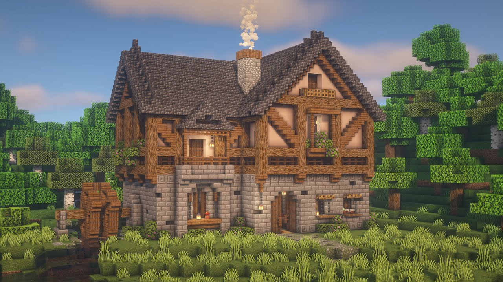

With no prior experience or knowledge of TypeScript I was thrown into a completely new environment. It’s almost as if I was just starting construction on a new house, with many building blocks around me to utilize for it. You see, the only languages I have prior experience with are Java, C++, HTML, and Python, which are arguably way different than TypeScript. This world of TypeScript is new and fresh, something that came as a surprise to me. 

## The Door: Syntax

After some practice with TypeScript in regards to the practice WODs and assignments, I found that it is extremely similar to Java’s syntax. However, there was a little twist to it since defining variables is done through the let, const, and var keywords in which var is stressed to not be used. Along with this, semicolons are still placed after almost every line of code that is not a function name. 

Seeing all the new setups for this language served as the door for me because it opened up a new skill to learn in my journey to become a great Software Engineer. I can now add the door to my house and start the process of finishing it. 

## The Walls: Functions

Functions served to be very wonky for me because they have different styles you can use for them. For one, they are objects in TypeScript and can be assigned to variables which was very surprising to me. Along with this, the parameters are defined by “variable name: variable type” which is different from the usual java syntax I am used to. TypeScript takes it even further by letting you define a whole function on one line using the “=>” keyword and pointing to what you want the function to do if the function body is only one line long.

The reason the functions serve as the walls of my house is because they are the foundation and main structure of my house. Now that I have opened up the door to JavaScript, learning all about the functions will allow me to place and customize my walls to be whatever I like. The better I get at JavaScript, the stronger and fancier my walls get. 

## The Roof: The Ease of Code

Now for my Roof. Typescript basics make up most of my house, but the reason the ease of using it makes up my roof is because that is what completes it. For example, instead of having to define your functions like in Java:
public int sum(int x, int y){
	Return x+y;
}

You can instead define them like:
	const sum = (x: number, y: number): number => x + y;

reducing the amount of lines you need for it.

## Finished House!

We did it! After putting all the building blocks of Typescript together, I think that the house looks beautiful. Typescript is a very useful and engaging language that challenges the user to simplify code as much as they can. It improves the readability of your code and is very crucial to Software Engineering as a whole. I hope to incorporate this language into one of the games I make soon!

## Typescript Review

With learning any language, practice makes perfect. In my Software Engineering class right now, I feel that the WODs we do are very helpful for me to practice repetition of writing Typescript programs. I haven’t done many so I cannot say for sure how I feel about them fully, but so far I enjoy them. I imagine myself getting stressed with the harder ones, but hopefully with enough studying I can prevent a lot of stress. This style of athletic software engineering will be effective for my work life in the future, so I appreciate all the practice I can get with it right now.

## Credits

I used ChatGPT to search up how Typescript is a simple langauge and for the code I included in this essay.
