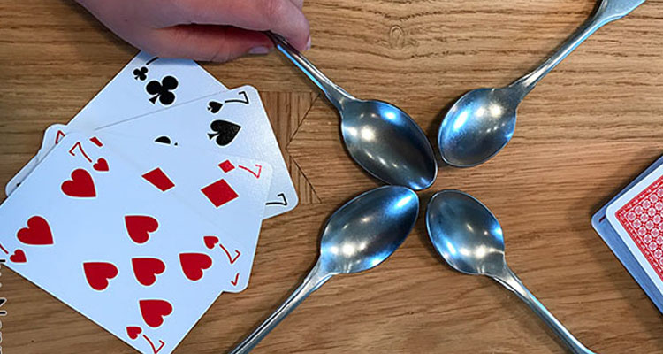

For a project in my Java programming class, me and two of my friends made a console game in VScode based on the card game called Spoons. This game would run until all of the spoons were taken and someone loses. It was a project that was a big part of my grade and took many sleepless nights to complete due to the unqiue algorithm of the game.

For this project, I worked a lot on the deck and card classes while me and my two other group members worked on the game class together. My main prority was to just get the algorithm of the game to work. It took many attempts and a lot of use of ChatGPT, but eventually I was able to solve the issue and get that part of the code running.

Before making this project, I had no idea what the spoons game was. Unfortunately, this made the process of making the game a bit harder since me and my teammates had to research and learn how to play spoons, but once we got it down, everything else came into play. Initializing all the classes for the deck, dealer, cards, etc. was simple and did not take that long for us to do, however the implementation for the game class was very tricky and it took us a lot of trial and error until we were able to get it running. Basically, this project taught me a lot about trial and error until your code likes you and starts running. 
