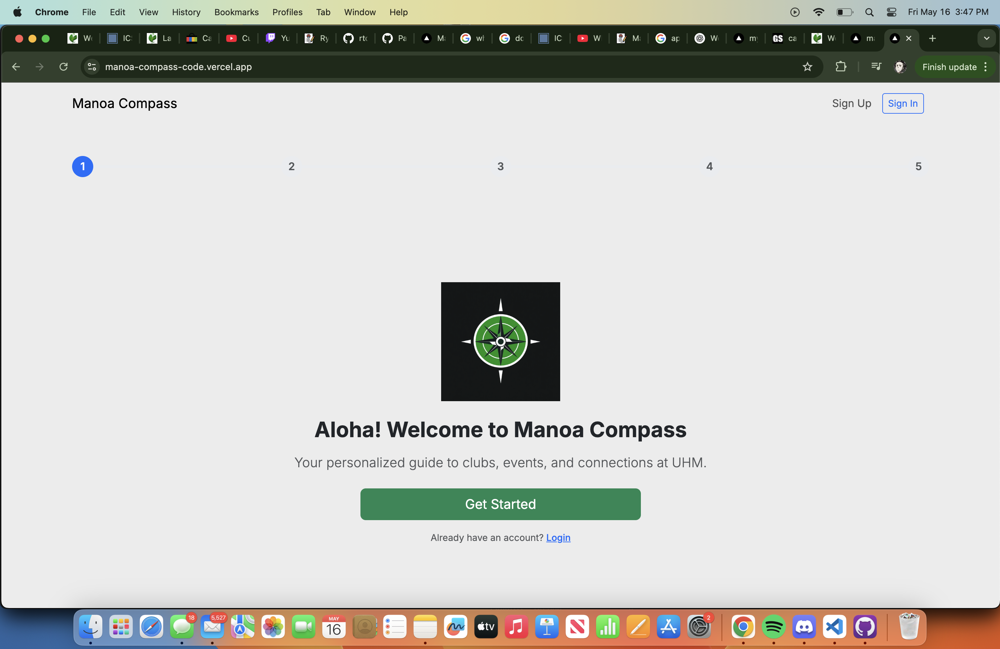

# Project Overview
Manoa Compass is a web application developed by myself and 4 other students built for the purpose of helping students at the University of Hawaiʻi at Mānoa view the different clubs and events Manoa has to offer... however there is a twist. Thanks to our AI integration from Gemini, users create specialized profiles that are read and matched to events and clubs that match the user's preferred profile. Information is scraped via official University sites and provides a streamlined experience for students to easily get involved on campus.

# Key Features
- Onboarding flow to capture user data
- Recommendation machine using an LLM (Gemini API) for content classification and rule-based logic
- Ability to search and filter through all clubs and ongoing events at Manoa
- RSVP and Follow buttons for events and clubs respectively
- Calendar Integration
- Admin dashboard to manage/schedule data scraping and current data

# Contribution
My role in the project was to provide dynamic backend code to match the UI for the onboarding process and profile page. My focus for this area was to make the signup as simple and inclusive as possible for any students signing up. Furthermore, editing the user profile and adding and displaying RSVPed and Followed events and clubs on their page allowed for an enhanced experience

# Source Code

https://github.com/manoa-compass/manoa-compass-code

# Final Thoughts
For me, this project was an introduction to the use of LLMs and routed APIs for each of your pages on a website. I had little to no previous experience beforehand so understanding that everything starting from the database, to the routings of each website page, to the React formatting, all mattered heavily was crucial. One small mistake could crash the entire site, so interactive websites require lots of care and attention. Thankfully, I feel that I have gathered the skills and knowledge necessary for developing another one going forward.
